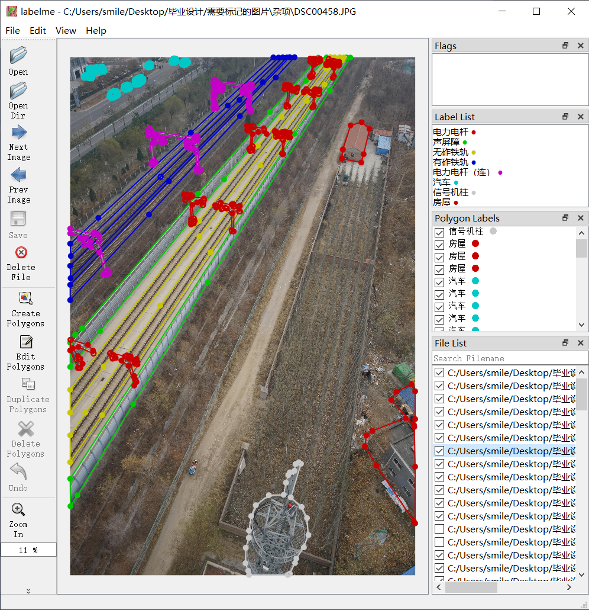
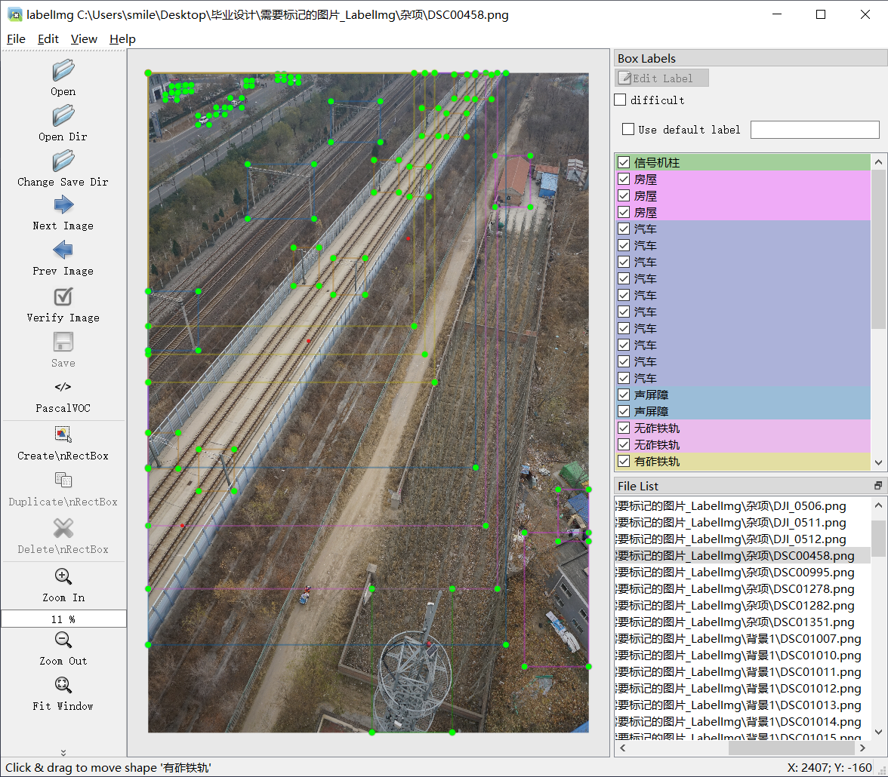

# Labelme标注文件格式(json)转labelImg标注文件格式(xml)

## 效果展示

Labelme标注截图

转换后的labelImg截图

* 支持中文路径和中文标签；
* 从Labelme中的边界轮廓线中，保存最大的矩形边框(xmin,xmax,ymin,ymax)；
* 仅处理图片和`json`文件能够一一匹配的LabelMe标注；
* 不保留Labelme中的分组信息。

## 使用方法
1. 安装Pillow库
2. 修改`labelme2labeling.py`文件中`source_path`和`target_path`为自己的文件夹
3. 执行`labelme2labeling.py`

**注意：**
* 因为Labelme 和 LabelImg 对JPEG图像的读取方式存在差异，Labelme会读取EXIF信息，自动处理旋转信息；LabelImg则不会，最终可能导致坐标不一致。
* 当前处理方式是把图片另存到target_path，并保存相同文件目录结构，EXIF信息可参见以下连接
  [https://blog.csdn.net/taoszu/article/details/83051879](https://blog.csdn.net/taoszu/article/details/83051879)